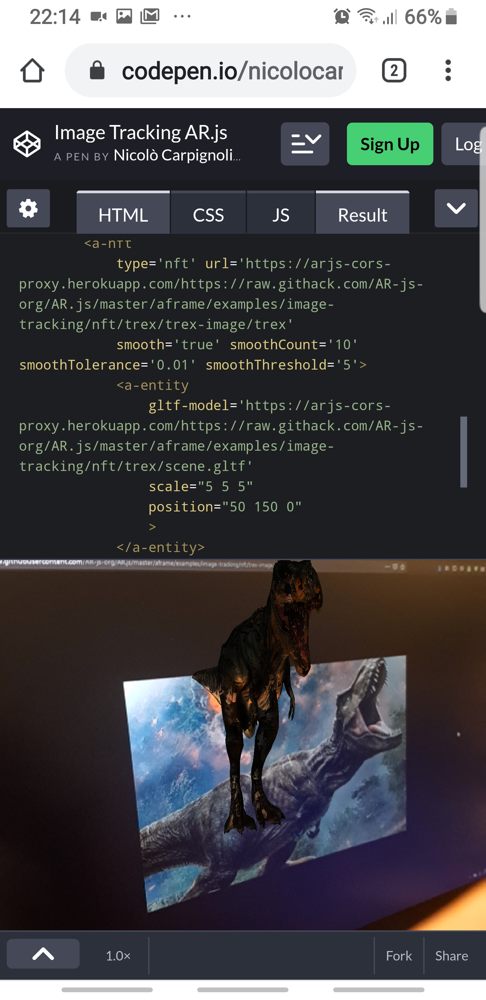
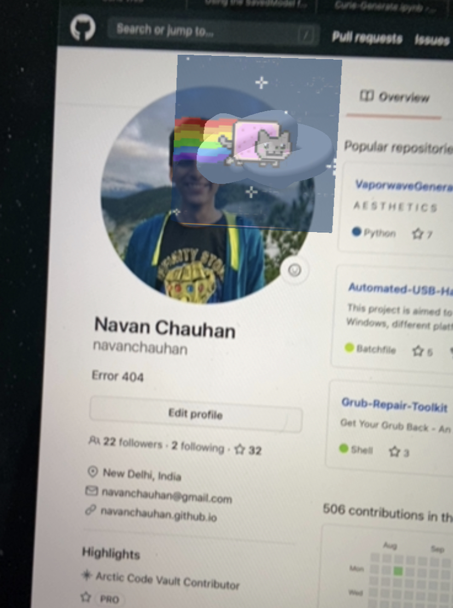

 

#### this is a continuation of (What _Web_ AR means (Augmented Reality on the Web)) 👍

 
 

### What is AR JS?

 

##### AR. js is a lightweight library for Augmented Reality on the Web, which includes features like Image Tracking, Location based AR and Marker tracking.

It is the easiest option for cross-browser augmented reality.

##### The same code works for iOS, Android, Desktops and even VR Browsers!

It was initially created by Jerome Etienne and is now maintained by Nicolo Carpignoli and the AR-js Organisation

 
 

## Why AR.js

> Credits: [AR.js - Augmented Reality on the Web](https://ar-js-org.github.io/AR.js-Docs/)

 
 

We believe in the Web, as a collaborative and accessible environment. We also believe in Augmented Reality technology, as a new communication medium, that can help people see reality in new, exciting ways. **We see Augmented Reality (AR) used everyday for a lot of useful applications, from art, to education, also for fun.**

We strongly believe that such a powerful technology, that can help people and leverage their creativity, should be free in some way. Also collaborative, if possible. And so, we continue the work started by Jerome Etienne, in bringing AR on the Web, as a free and Open Source technology.

Thank you for being interested in this, if you'd like to collaborate in any way, contact us (https://twitter.com/nicolocarp).

The project is now under a Github organization, that you can find at https://github.com/ar-js-org and you can ask to be part of it, for free.

 

## AR types

#### AR.js features the following types of Augmented Reality, on the Web:

**Image Tracking**, when a 2D images is found by the camera, it's possible to show some kind of content on top of it, or near it. The content can be a 2D image, a GIF, a 3D model (also animated) and a 2D video too. Cases of use: Augmented Art, learning (Augmented books), Augmented flyers, advertising, etc.

 

**Location Based AR**, this kind of AR uses real-world places in order to show Augmented Reality content, on the user device. The experiences that can be built with this library are those that use a user's position in the real world.    **The user can move (ideally outdoor) and through their smartphones they can see AR content where places are in the real world. Moving around and rotating the phone will make the AR content change according to users position and rotation (so places are 'anchored' in their real position, and appear bigger/smaller according to their distance from the user).** 🌥️    With this solution it’s possible to build experiences like interactive **support for tourist guides, assistance when exploring a new city, find places of interest like buildings, museums, restaurants, hotels and so on.** It’s also possible to build learning experiences like treasure hunts, and biology or history learning games, or use this technology for situated art (visual art experiences bound to specific real world coordinates).

 

**Marker Tracking**, When a marker is found by the camera, it's possible to show some content (same as Image Tracking). Markers are very stable but limited in shape, color and size. **It is suggested for** those experiences where are required a lot of different markers with different content. Examples of use: **(Augmented books), Augmented flyers, advertising.** 👍

 

#### Key points 🔴

- Very Fast : It runs efficiently even on phones

- Web-based : It is a pure web solution, so no installation required.

- Fully javascript based, using **three.js** ✋ + A-Frame + jsartoolkit5

- Open Source : It is completely open source and free of charge!

- Standards : It works on any phone with webgl and webrtc

 

- AR.js has reached version 3. This is the official repository: https://github.com/AR-js-org/AR.js. If you want to visit the old AR.js repository, here it is: https://github.com/jeromeetienne/AR.js.

 

#### Import the library

 

AR.js from version 3 has a new structure.

AR.js comes in two, different builds. They are both maintained. They are exclusive.

The file you want to import depends on what features you want, and also which render library you want to use (A-Frame or three.js).

AR.js uses jsartoolkit5 for tracking, but can display augmented content with either three.js or A-Frame.

#### Watch the tutorial here: [Tutorial: augmented reality web app using AR.js & A-Frame](https://www.youtube.com/watch?v=NIXJJoqM8BQ)

#### Copy the scripts here: [AR.js - Augmented Reality on the Web](https://ar-js-org.github.io/AR.js-Docs/)

 

 
 

---

 
 

### NFT 🍭

#### WebXR and AR.js NFT (image tracking)

- Here you will be able to scan your nft and show it like the img below

> **check the cool video** [WebXR and AR.js NFT (image tracking)](https://youtu.be/sRfZ0NWFOD8)

 

 

 

### Cool tutorial ✨ at the end you will be adding an ar profile img to your github

 

#### Introduction to AR.js and Natural Feature Tracking

 
 

#### But before that, follow this instructions to make it work, later on we will continue with the github idea. CHECK THE TUTORIAL HERE: [Introduction to AR.js and Natural Feature Tracking](https://web.navan.dev/posts/2020-08-01-Natural-Feature-Tracking-ARJS)

 
 

### [AR.js video with UNITY ](https://www.youtube.com/watch?v=_WnyC2ZrDls)

 
 

---

 

 

## AR.js STUDIO

- **AR.js Studio is an open-source AR creation platform for building custom augmented reality experiences.** You can create location-based or marker-based AR applications and deploy them straight to the web. That means you won’t have to download any extra apps to access your experience! Working with AR.js Studio doesn’t require any knowledge of coding, either. You can start creating your first AR project right now.

 

#### [Web-enabled AR experiences](https://ar-js-org.github.io/studio/)
