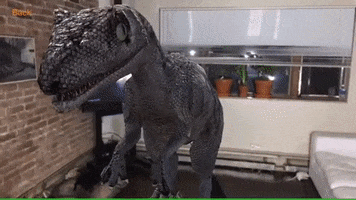
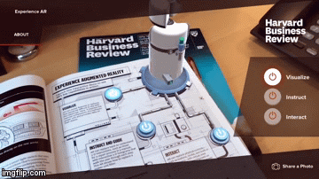

##### [all the ressources / links & tutorials](/tutorials.md) 🌻

[Before You Start Creating An Augmented Reality App Watch This !](https://youtu.be/HEJ-1-Loffc)

 
 

 

# 🍨

### Let's get started !!!

 

---

 

## Extended Reality

 

#### Introduction to <u>Extended Reality</u>

> Extended Reality contains 3 subdomains(children):

- Augmented Reality

- Virtual Reaĺity

- Mixed Reality

 
 
## Augmented Reality 🦖

> Augmented reality is an interactive experience of a real world environment where the objects that reside in the real world are enhanced by computer generated perceptual information, sometimes across multiple sensory modalities, including: **visual, auditory, haptic, somatosensory and olfactory.**

- Examples: Pokemon GO, ARLoopa, Ikea Place.

 

 

### Types of Augmented Reality

 

##### Marker-Based Augmented Reality

##### Marker-Less Augmented Reality

- Super Imposition AR

- Location Based AR

- Projection Based AR

- Outlining AR

 
 

#### Marker vs. Markerless Augmented Reality

**Two of the most prevalent paths for experiencing AR are marker-based and markerless.**     Early-stage AR technologies were marker-based. Markerless AR is now the preferred image recognition method for AR applications.

**Marker-based AR** apps use markers (target images) to indicate things in a given space. These markers determine where the AR application places digital 3D content within the user’s visual field or through a camera feed.

**Markerless AR** places virtual 3D objects in the physical environment depending on the environment’s real features rather than identifying markers. This differentiation eliminates the need for object tracking systems. Markerless AR experiences are possible because of advancements in cameras, sensors, processors, and algorithms capable of accurately detecting and mapping the real-world.

**source:** [The Ultimate Guide to Markerless Augmented Reality](https://www.marxentlabs.com/what-is-markerless-augmented-reality-dead-reckoning/)

 
 

 
 

### Marker-Based AR ✋

[Augmented Reality for Everyone - Full Course
](https://youtu.be/WzfDo2Wpxks?t=572)

 

> **This type of AR** works on the concept of tracking and recognition. In this type of AR you need to have a marker through which you could perform the augmentation.

**In general this augments Digital Objects upon a marker.** (the marger is the img icon on the center of the leaf, it can also be a QR code )

 

> Credits images above and below: [Krit Salah-ddine](https://www.researchgate.net/figure/example-of-marker-based-AR_fig1_332543647) >   [AUGMENTED REALITY TYPES AND POPULAR USE CASES](https://www.researchgate.net/publication/332543647_AUGMENTED_REALITY_TYPES_AND_POPULAR_USE_CASES)

 

#### As you can see, the 3d object stays in the place where the marker is.

 
 

 
 

### Marker-less AR ✋

[Augmented Reality for Everyone - Full Course
](https://youtu.be/WzfDo2Wpxks?t=572)

 

> **Marker-less AR is not bounded to a particular marker, but rather allows users to position objects anywhere they want within their real-world view.**    After placing an object, even if the device camera is removed from the line of sight, the application still remembers the position of the object using a method called Simultaneous Localization and Mapping (SLAM), and so when the device is brought back into line of sight the object is once again visible.

**source:** [Educational Applications of Augmented Reality (AR) and Virtual Reality (VR) to Enforce Teaching the "National Academy of Engineering Grand Challenges for Engineering in the 21st Century"](https://www.researchgate.net/publication/358376492_Educational_Applications_of_Augmented_Reality_AR_and_Virtual_Reality_VR_to_Enforce_Teaching_the_National_Academy_of_Engineering_Grand_Challenges_for_Engineering_in_the_21st_Century)

 

 

**Markerless AR systems that use RGB-D SLAM and sensor fusion approaches** are on the opposite end of the spectrum.    **Microsoft HoloLens** is the most notable example. These systems integrate information from standard, red, green, and blue (RGB) cameras with state-of-the-art infrared time-of-flight cameras to construct a 3D map of the user’s surroundings while they use the application. This feature is a critical component of the SLAM tracking paradigm, as it enables apps running on these devices to place virtual content within the space concretely.

 

#### Advantages of Markerless AR 🍨

> Markerless AR eliminates the need for capturing physical markers to trigger virtual interaction has the following advantages:

- You significantly increase the average range of motion while experiencing AR.

 

- You can initialize the application anywhere with a handheld device or a see-through headset like glasses or goggles.

 

- You can share the experience with others.

 

- You experience a wider field of view for AR content.

 
 

#### Disadvantages of Markerless AR

Despite the benefits of markerless AR technology over earlier systems, challenges remain. The technology is mostly dependent on flat, textured surfaces to successfully render virtual images. Also, apps running on mobile devices use a lot of power.

**Adoption is slow due to the lack of acceptance for AR wearables (glasses or headsets) and commercial investments.** 🔴 Still, AR headsets continue to grow as a segment of the gaming industry, with smaller markets developing in healthcare, academics, and industrial applications.

**Pros and Cons of Markerless AR**

Benefits & Challenges

- Increase range of motion with AR
- Depends of flat, textured surfaces

 

- Use a headset to initialize an AR app
- Apps running mobile consume a lot of power

 

- Share the experience
- Slow adoption

**source:** [The Ultimate Guide to Markerless Augmented Reality](https://www.marxentlabs.com/what-is-markerless-augmented-reality-dead-reckoning/)

 
 
 
 

#### More on markerless AR

**[Houzz](https://www.houzz.com)** customers are able to place **"true-to-scale"** digital representations of furniture and other home décor products in their rooms. Users can place multiple objects at a time, and the wares are displayed with ambient lighting taken into account.

 

The app saves each previewed product to a shopping list for later purchase within the app, which supports Apple Pay. For those who are not ready to throw their money at Houzz just yet, the app also doubles as a Pinterest-like idea board, allowing users to capture their prospective designs for later reference.

> ✋ **Read More:** [Houzz ARKit App Beats IKEA to the App Store](https://mobile-ar.reality.news/news/apple-ar-houzz-arkit-app-beats-ikea-app-store-0180132/)

 
 

---

 
 

 
 

### Super Imposition AR ✋

 

Superimposition-based augmented reality uses object recognition. **The augmented image replaces the original image either partially or fully**. This type of AR is commonly used in the medical field to superimpose an X-ray onto a patient's body. It can also be used to enhance a historical tour.

 

AR breaks the barriers to 3D: A **CAD** engineer can use AR **to superimpose a model** on thenphysical world as a hologram. This creates new and more efficient ways to evaluate and improve designs

  

- click on the img to see the video:

> ✋ **Read More:** [Three ways AR is already Reshaping Product Design](https://www.ptc.com/en/blogs/cad/3-ways-ar-is-already-reshaping-product-design)

 

---

 
 

 
 
