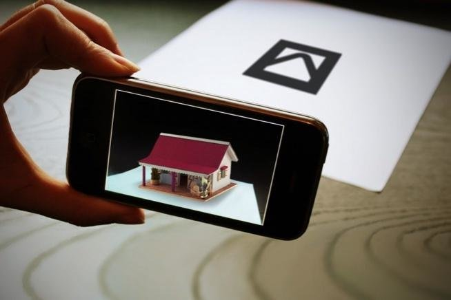

##### [all the ressources / links & tutorials](/tutorials.md) 🌻

[Before You Start Creating An Augmented Reality App Watch This !](https://youtu.be/HEJ-1-Loffc)

 
 

 

# 🍨

### Let's get started !!!

 

---

 

#### Introduction to <u>Extended Reality</u>

> Extended Reality contains 3 subdomains(children):

- Augmented Reality

- Virtual Reaĺity

- Mixed Reality

 
 
## Augmented Reality 🦖

> Augmented reality is an interactive experience of a real world environment where the objects that reside in the real world are enhanced by computer generated perceptual information, sometimes across multiple sensory modalities, including: **visual, auditory, haptic, somatosensory and olfactory.**

- Examples: Pokemon GO, ARLoopa, Ikea Place.

 

 

### Types of Augmented Reality

 

##### Marker-Based Augmented Reality

##### Marker-Less Augmented Reality

- Super Imposition AR

- Location Based AR

- Projection Based AR

- Outlining AR

 
 

### Marker-Based AR ✋

[Augmented Reality for Everyone - Full Course
](https://youtu.be/WzfDo2Wpxks?t=572)

 

> **This type of AR** works on the concept of tracking and recognition. In this type of AR you need to have a marker through which you could perform the augmentation.

**In general this augments Digital Objects upon a marker.** (the marger is the img icon on the center of the leaf, it can also be a QR code )

 

> CRedits images above and below: [Krit Salah-ddine](https://www.researchgate.net/figure/example-of-marker-based-AR_fig1_332543647) >   [AUGMENTED REALITY TYPES AND POPULAR USE CASES](https://www.researchgate.net/publication/332543647_AUGMENTED_REALITY_TYPES_AND_POPULAR_USE_CASES)

 
 
